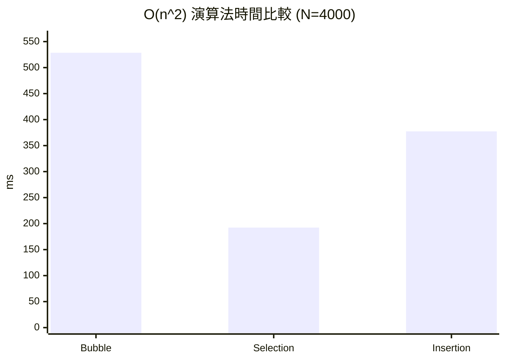
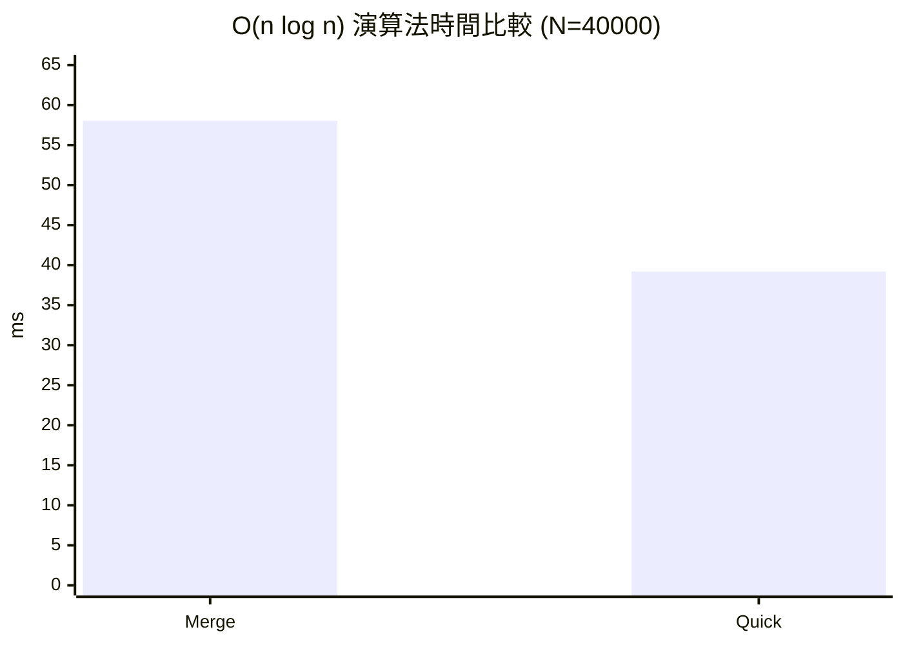

# 排序報告

學號: 11428224\
姓名: 鄭恆騏\
模擬頁面: https://zh7238.github.io/sort/
報告內容包含五種排序法的介紹、視覺化模擬頁面、排序法實作以及不同排序法的複雜度實驗與結果分析。

---

# 排序法原理

## 氣泡排序法

#### 基本原理
氣泡排序法會反覆比較相鄰兩個元素，若前者比後者大就交換，讓較大的元素逐步往後移動。

#### 操作方式
1. 從陣列最前面開始，比較相鄰兩個元素。
2. 若順序錯誤就交換位置。
3. 完成一輪後，最大值會移到最後面。
4. 對剩下尚未排序的部分重複上述步驟，直到完成排序。

#### 時間複雜度與空間複雜度
- 最佳時間複雜度：O(n)
- 平均時間複雜度：O(n^2)
- 最差時間複雜度：O(n^2)
- 空間複雜度：O(1)

---

## 選擇排序法

#### 基本原理
選擇排序法每一輪都從未排序區中找出最小值，並將它放到目前應該排序的位置。

#### 操作方式
1. 先假設未排序區的第一個元素是最小值。
2. 從剩下的元素中找出真正的最小值。
3. 將最小值與未排序區的第一個元素交換。
4. 縮小未排序區，重複以上步驟直到結束。

#### 時間複雜度與空間複雜度
- 最佳時間複雜度：O(n^2)
- 平均時間複雜度：O(n^2)
- 最差時間複雜度：O(n^2)
- 空間複雜度：O(1)

---

## 插入排序法

#### 基本原理
插入排序法會把資料分成已排序與未排序兩部分，每次從未排序區取出一個元素，插入到已排序區的正確位置。

#### 操作方式
1. 從第二個元素開始，將它視為要插入的值。
2. 與左邊已排序區的元素由右往左比較。
3. 若左邊元素較大，就往右移動一格。
4. 找到正確位置後，將目前元素插入。
5. 持續重複直到全部資料完成排序。

#### 時間複雜度與空間複雜度
- 最佳時間複雜度：O(n)
- 平均時間複雜度：O(n^2)
- 最差時間複雜度：O(n^2)
- 空間複雜度：O(1)

---

## 合併排序法

#### 基本原理
合併排序法使用分治法，先把陣列不斷切成兩半，直到每個子陣列只剩一個元素，再將已排序的子陣列逐步合併。

#### 操作方式
1. 將陣列分割成左右兩半。
2. 對左右兩半遞迴執行相同的分割動作。
3. 當子陣列只剩一個元素時，視為已排序。
4. 將兩個已排序子陣列合併成一個更大的已排序陣列。
5. 不斷重複合併，直到整個陣列完成排序。

#### 時間複雜度與空間複雜度
- 最佳時間複雜度：O(n log n)
- 平均時間複雜度：O(n log n)
- 最差時間複雜度：O(n log n)
- 空間複雜度：O(n)

---

## 快速排序法

#### 基本原理
快速排序法會選擇一個基準值（pivot），將比 pivot 小的元素放到左邊，比 pivot 大的元素放到右邊，再對兩邊遞迴排序。

#### 操作方式
1. 選擇一個基準值 pivot。
2. 進行分割，將小於 pivot 的值移到左邊，大於 pivot 的值移到右邊。
3. pivot 會停在最終正確位置。
4. 對左右兩個子陣列重複相同流程。
5. 當子陣列長度小於 2 時，遞迴結束。

#### 時間複雜度與空間複雜度
- 最佳時間複雜度：O(n log n)
- 平均時間複雜度：O(n log n)
- 最差時間複雜度：O(n^2)
- 空間複雜度：O(log n)

---

# 複雜度分析

本實驗目標為比較排序 n 個數所需時間，並分析不同排序法在資料規模增加時的效能差異。

## 實驗設計

#### 實驗目的
1. 比較五種排序法在不同資料規模 n 下的排序時間。
2. 驗證各排序法的理論時間複雜度是否與實測趨勢一致。
3. 觀察資料分布（已排序、隨機、逆序）對排序效能的影響。

#### 實驗變因
1. 自變因：資料規模 N（例如 1000、2000、4000、8000、16000）。
2. 應變因：排序所需時間（秒）。
3. 控制變因：同一台電腦、同一編譯器與優化設定、相同測時方式、相同重複次數。

#### 實驗流程
1. 先產生指定規模 N 的測試資料。
2. 針對每個排序法執行排序並使用 `clock()` 測時。
3. 每個 N 重複測試至少 5 次，計算平均時間。
4. 計算相鄰規模的時間倍率（例如 N 倍增後的時間比）。
5. 將結果填入表格，並與理論複雜度進行比對分析。

#### 實驗輸出
1. 各排序法在不同 N 下的平均執行時間表。
2. 各排序法的時間倍率比較。
3. 綜合分析結論（是否符合 O(n)、O(n^2)、O(n log n)）。

#### 共用測試設定
1. 使用 `clock()` 量測排序前後 CPU 時脈差。
2. 用 `(double)(end - start) / CLOCKS_PER_SEC` 換算秒數。
3. 每個 N 至少執行 5 次，取平均值。
4. 除了特別說明外，輸入資料預設採最差或接近最差情況。

#### 資料規模設計與觀察重點
1. 實驗資料量需設定不同規模的 N，例如 1000、2000、4000、8000、16000。
2. 以倍增方式增加 N，比較各規模下的平均排序時間。
3. 觀察 N 增加後時間成長倍率，並與理論複雜度比對。
4. 在圖表或表格中至少呈現「N、時間(秒)、倍率」三個欄位，以清楚說明時間隨 n 增加的變化。

---

## 1. 氣泡排序法複雜度實驗

#### 模擬程式重點
1. `bubble_sort` 函式：外迴圈控制每輪比較範圍，內迴圈做相鄰比較與交換。
2. `main` 函式：建立完全逆序陣列（最差情況），用 `clock()` 夾住排序前後取得執行時間。
3. 實驗表格：記錄不同 N 的平均時間與倍率。

#### 建議實驗參數
- N：1000、2000、4000、8000
- 預期倍率：N 倍增時，時間約增加 4 倍（符合 O(n^2)）

#### 判讀重點
若 N 從 1000 增至 10000（10 倍），時間大約增加 100 倍，代表實驗結果符合 O(n^2)。

#### 實驗結果表格
| N | 平均時間 (ms) | 與前一組倍率 |
| ---: | ---: | ---: |
| 1000 | 28.151 | - |
| 2000 | 126.205 | 4.48 |
| 3000 | 295.010 | 2.34 |
| 4000 | 528.477 | 1.79 |

---

## 2. 選擇排序法複雜度實驗

#### 模擬程式重點
1. `selection_sort` 函式：每輪先設 `minIndex`，內迴圈掃描未排序區找最小值，最後與前端交換。
2. `main` 函式：可使用隨機陣列或逆序陣列，並在排序前後以 `clock()` 測時。
3. 實驗表格：紀錄 N、平均時間、與前一組倍率。

#### 建議實驗參數
- N：1000、2000、4000、8000
- 預期倍率：N 倍增時，時間約增加 4 倍（符合 O(n^2)）

#### 判讀重點
選擇排序比較次數幾乎固定為 n(n-1)/2，所以最佳、平均、最差時間複雜度都接近 O(n^2)。

#### 實驗結果表格
| N | 平均時間 (ms) | 與前一組倍率 |
| ---: | ---: | ---: |
| 1000 | 12.524 | - |
| 2000 | 49.479 | 3.95 |
| 3000 | 114.079 | 2.31 |
| 4000 | 192.343 | 1.69 |

---

## 3. 插入排序法複雜度實驗

#### 模擬程式重點
1. `insertion_sort` 函式：從第 2 個元素開始，將 `key` 向左比較並插入正確位置。
2. `main` 函式：建議分別測三種資料型態（已排序、隨機、逆序）。
3. 實驗表格：同時列出三種資料型態的時間，觀察差異。

#### 建議實驗參數
- N：1000、2000、4000、8000
- 已排序資料預期倍率：N 倍增時約 2 倍（O(n)）
- 隨機/逆序資料預期倍率：N 倍增時約 4 倍（O(n^2)）

#### 判讀重點
插入排序對資料分布非常敏感，已接近有序時會顯著加速，這也是它在小規模或部分有序資料上常被採用的原因。

#### 實驗結果表格
| N | 平均時間 (ms) | 與前一組倍率 |
| ---: | ---: | ---: |
| 1000 | 22.380 | - |
| 2000 | 91.166 | 4.07 |
| 3000 | 208.583 | 2.29 |
| 4000 | 377.357 | 1.81 |

---

## 4. 合併排序法複雜度實驗

#### 模擬程式重點
1. `merge_sort` 函式：遞迴分割為左右子陣列。
2. `merge` 函式：將兩個已排序子陣列合併到暫存陣列，再回寫。
3. `main` 函式：以隨機資料為主，使用 `clock()` 測時並統計平均。

#### 建議實驗參數
- N：2000、4000、8000、16000、32000
- 預期倍率：N 倍增時，時間約落在 2.0 到 2.3 倍（接近 O(n log n)）

#### 判讀重點
若時間成長明顯小於 O(n^2) 的 4 倍倍率，且接近 2 倍多，表示符合 O(n log n) 特性。

#### 實驗結果表格
| N | 平均時間 (ms) | 與前一組倍率 |
| ---: | ---: | ---: |
| 5000 | 5.985 | - |
| 10000 | 12.885 | 2.15 |
| 20000 | 27.468 | 2.13 |
| 40000 | 58.032 | 2.11 |

---

## 5. 快速排序法複雜度實驗

#### 模擬程式重點
1. `quick_sort` 函式：遞迴排序左右分區。
2. `partition` 函式：選擇 pivot（建議實驗不同策略，如最後一個元素、隨機 pivot）。
3. `main` 函式：至少分別測隨機資料與已排序資料，觀察平均與最差差異。

#### 建議實驗參數
- N：2000、4000、8000、16000、32000
- 隨機資料預期倍率：N 倍增時約 2.0 到 2.3 倍（平均 O(n log n)）
- 已排序且固定邊界 pivot 預期倍率：接近 4 倍（最差 O(n^2)）

#### 判讀重點
快速排序理論上平均很快，但 pivot 選擇不佳會退化。透過不同輸入與 pivot 策略對照，可清楚驗證其平均與最差複雜度差異。

#### 實驗結果表格
| N | 平均時間 (ms) | 與前一組倍率 |
| ---: | ---: | ---: |
| 5000 | 3.599 | - |
| 10000 | 7.755 | 2.15 |
| 20000 | 17.350 | 2.24 |
| 40000 | 39.200 | 2.26 |

---

# 結果比較

## 表格整理

### 1) 同為 O(n^2) 排序法比較（N = 4000，逆序資料）

| 排序法 | 平均時間 (ms) | 相對最快倍率（以 Selection=1） |
| --- | ---: | ---: |
| 氣泡排序 | 528.477 | 2.75 |
| 選擇排序 | 192.343 | 1.00 |
| 插入排序 | 377.357 | 1.96 |

### 2) O(n log n) 排序法比較（N = 40000，隨機資料）

| 排序法 | 平均時間 (ms) | 相對最快倍率（以 Quick=1） |
| --- | ---: | ---: |
| 合併排序 | 58.032 | 1.48 |
| 快速排序 | 39.200 | 1.00 |

### 3) 代表規模下每千筆資料平均耗時（ms / 1000 筆）

| 排序法 | 代表 N | 代表時間 (ms) | ms / 1000 筆 |
| --- | ---: | ---: | ---: |
| 氣泡排序 | 4000 | 528.477 | 132.119 |
| 選擇排序 | 4000 | 192.343 | 48.086 |
| 插入排序 | 4000 | 377.357 | 94.339 |
| 合併排序 | 40000 | 58.032 | 1.451 |
| 快速排序 | 40000 | 39.200 | 0.980 |

## 圖表整理

### 1) O(n^2) 排序法在 N=4000 的時間比較

### 2) O(n log n) 排序法在 N=40000 的時間比較

## 效能差異比較結論

1. 在 O(n^2) 三種排序法中，本次實測為「選擇排序最快、插入排序次之、氣泡排序最慢」。
2. 在 O(n log n) 兩種排序法中，本次實測快速排序快於合併排序。
3. 當資料量放大時，O(n log n) 相較 O(n^2) 的優勢非常明顯。
4. 此結果符合理論複雜度趨勢，但實際數值仍會受硬體、語言實作與資料分布影響。

---

